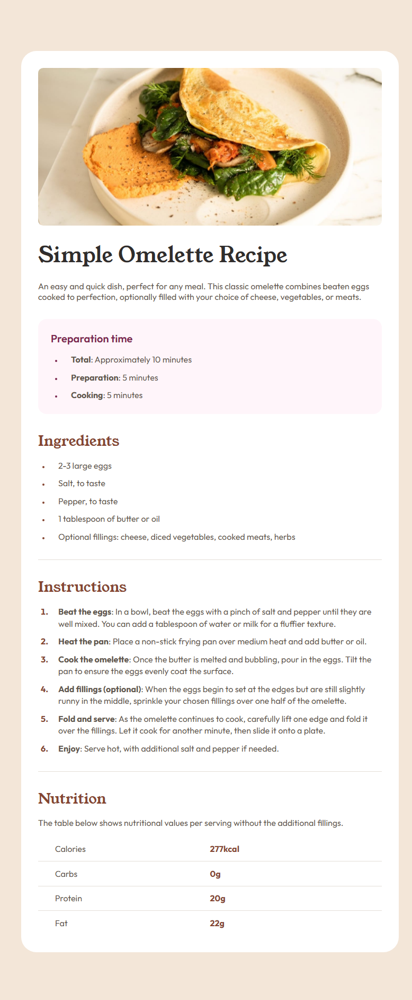
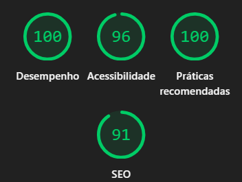

# Frontend Mentor – Recipe Page Solution 

This is my solution to the [Recipe page challenge on Frontend Mentor](https://www.frontendmentor.io/challenges/recipe-page-KiTsR8QQKm).  
The objective of this project was to replicate a static design as accurately as possible using only the provided reference image (no Figma).

## Overview

### The challenge

- Build a responsive recipe page based on a static design reference
- Replicate spacing, typography, colors, and layout as closely as possible
- Use semantic HTML and clean, well-structured CSS
- Ensure good responsiveness and overall quality

### Screenshot

### Links

- [Solution URL](https://www.frontendmentor.io/solutions/responsive-css-and-html-page-using-bem-and-mobile-first-convetions--ie6MAZSuY)
- [Live Site URL](https://drey-1.github.io/Recipe-page/)

## Performance & Quality

This project was audited using **Google Lighthouse**, achieving strong results across all key metrics:

Audit performed on both desktop and mobile viewports, achieving the same scores.

- **Performance:** 100
- **Accessibility:** 96
- **Best Practices:** 100
- **SEO:** 91

## My process

### Built with

- Semantic HTML5
- CSS custom properties (variables)
- Flexbox
- Mobile-first workflow
- Custom font loading with `@font-face`
- BEM naming convention

### What I learned

While working on this project, I reinforced important frontend fundamentals such as:

- Writing semantic and accessible HTML
- Structuring CSS using a consistent naming methodology
- Managing typography and spacing with precision
- Recreating a design accurately using only a visual reference
- Improving attention to layout details and responsiveness

This project helped strengthen my confidence in building clean, high-quality static layouts.

### Continued development

For future projects, I plan to continue focusing on:

- Improving CSS architecture and component reuse
- Refining accessibility best practices
- Reducing unnecessary CSS complexity
- Progressing towards more interactive projects using JavaScript and React

## Author

- [GitHub Profile](https://github.com/Drey-1)
- [Frontend Mentor Profile](https://www.frontendmentor.io/profile/Drey-1)

## Acknowledgments

Challenge provided by [Frontend Mentor](https://www.frontendmentor.io), which offers excellent real-world frontend practice projects.

